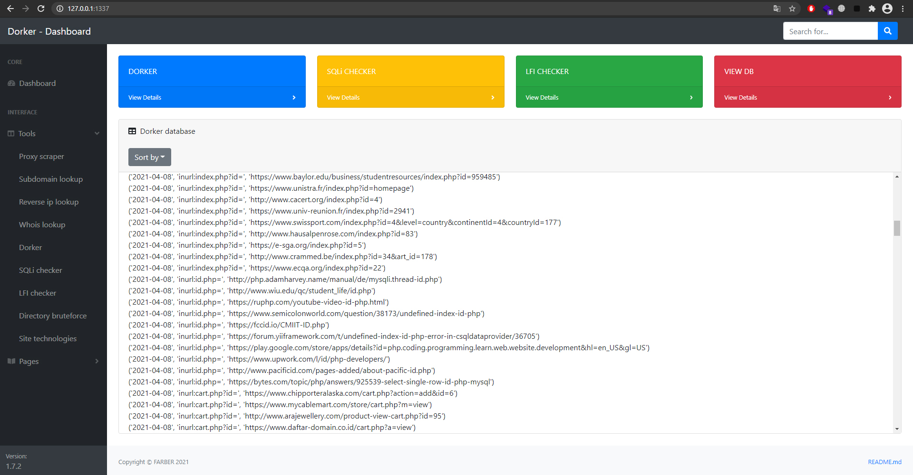
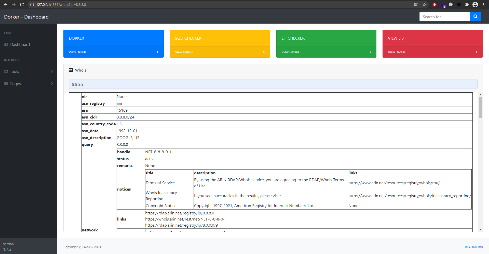
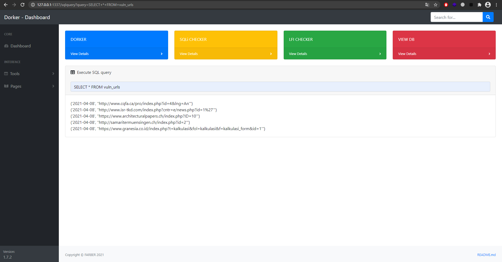

# WEBDorker
Dorker but with web interface and some new cool features.

This tool can be quite useful in early phases of pentest.
```
Current tool set:
[1] Proxy scraper - gives list of proxies;
[2] Subdomain lookup - gives list of site subdomains;
[3] Reverse ip lookup - gives DNS records associated with an IP address;
[4] Whois lookup - whois info about IP;
[5] Dorker - scrape and add new urls to DB;
[6] SQLi checker - checks urls from DB for SQLi;
[7] LFI checker - checks urls from DB for LFI;
[8] Directory bruteforce (WIP) - gives list of site directories;
[9] Site technologies - gives list of technologies used by the site.
```
## Screenshots:






## Remember, development is still in progress, you may encounter bugs.
